# **Retinal Vessel Segmentation**

>Author：zhiyu-Lin

>Date：2018-7-1

>E-mail: jhyxlzh@126.com

>Description: 眼底图像中视网膜血管的分割，数字图像处理大作业。

###前言

随着近年医学设备和科技的发达，越来越多的医学图像被运用到病理诊断和医学研究当中去。其中视网膜图像是其中非常重要一类的医学图像，对于一些眼球疾病的预测和诊断有非常高的指导意义。 本篇报告讲述如何使用深度卷积神经网络对眼底图像进行视网膜分割。**方法：**训练二分类分割神经网络和多分类分割神经网络（粗和细血管分二类），使用二分类网络结果图像指导增强原图像，使用多分类网络进行二次分割。**结果：**实验结果表明，对于大部分眼底图像进行二次分割比一次分割得到的准确率更高，在测试集上的F1值达到0.8253。

###环境

python>=3.5

pytorch==0.3.0.post4

torchvision==0.2.0

numpy==1.13.1

PIL==4.2.1

```shell
pip install -r requirements.txt
```

### 数据

使用公开数据集DRIVE,其中训练集20张图片，经过灰度化，直方图均衡化和Gamma值调节后增加图像对比度。

对于原始20张图像，经过旋转，水平翻转，垂直翻转进行数据增强，从原始的20张增强到7200张。

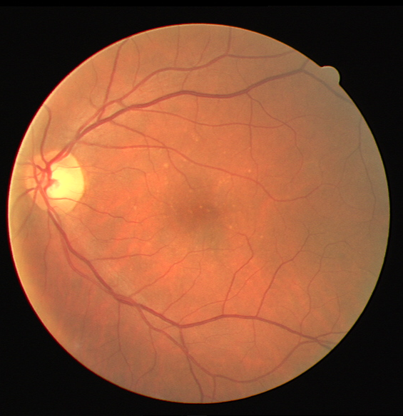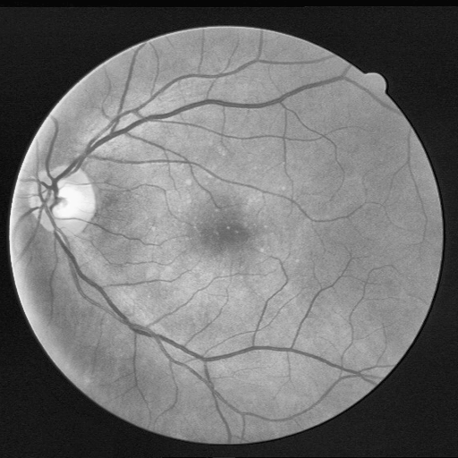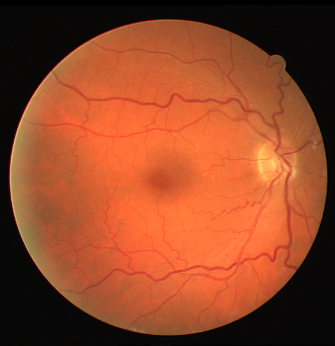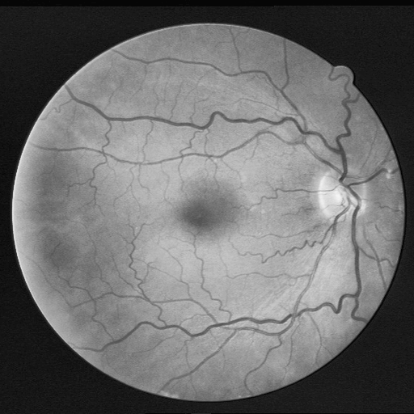

同时对于训练集的label, 生成用于多分类分割网络训练的图像。经过算法处理后，label中的粗细血管能被完整地区分出来，用于多分类分割网络的训练。

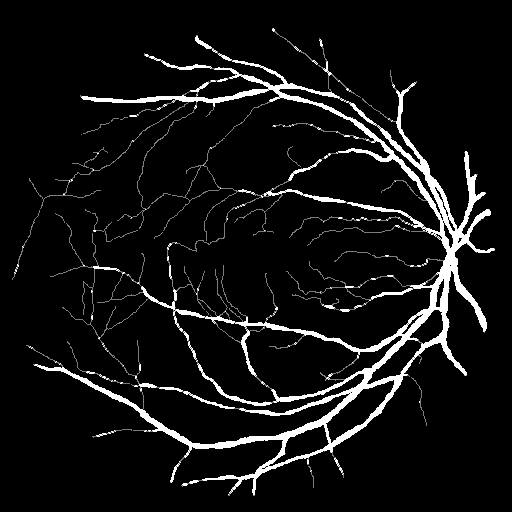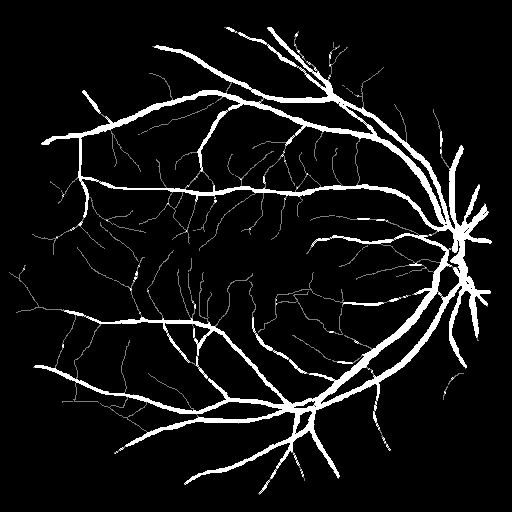

### 运行

```python
#训练
CUDA_VISIBLE_DEVICES=0 python train.py
```

```python
#测试
CUDA_VISIBLE_DEVICES=0 python test.py
```

### 结果

模型在测试集的表现呈现下表中，从表中可以看出测试集在FC-DenseNet(Binary)+FC-DenseNet(Multi)上的效果最好。在FC-DenseNet(Multi)中，粗血管和细血管被分类后进行分割。

|    Methods    | F1-Score  |
| :-----------: | :-------: |
| FC-DenseNet-B |   0.810   |
| FC-DenseNet-M |   0.811   |
|      M+B      | **0.825** |

三种模型在测试集上的PR曲线，在多分类分割网络中，结果为二值图片，在图中以点的形式表示。

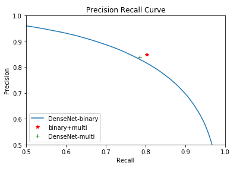

下图分别为原始图片，分割结果图片，label。从分割图片上来看对于一些比较细的血管已经能够清晰地分割，但是也存在的一些问题，对于一些本来不存在的血管，也被分割了出来。

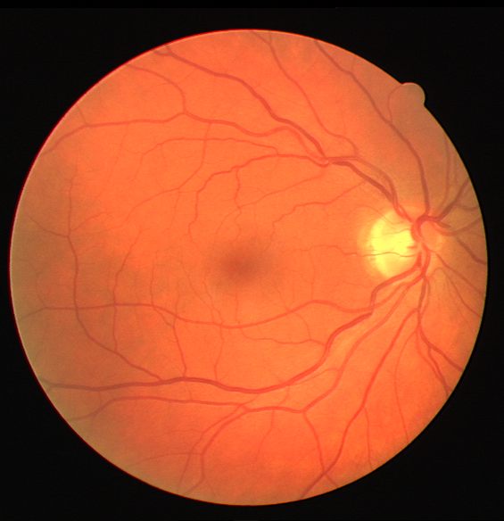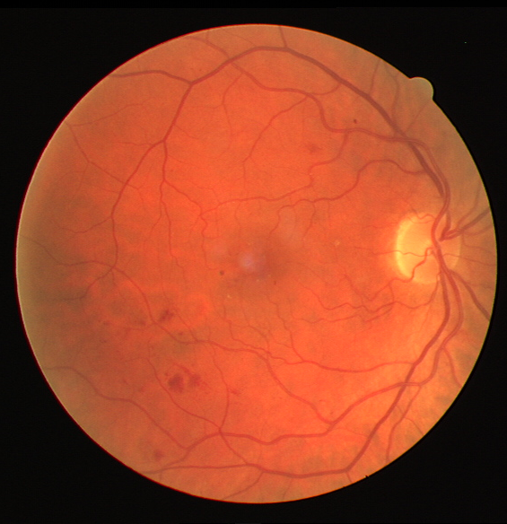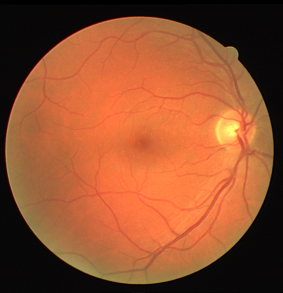

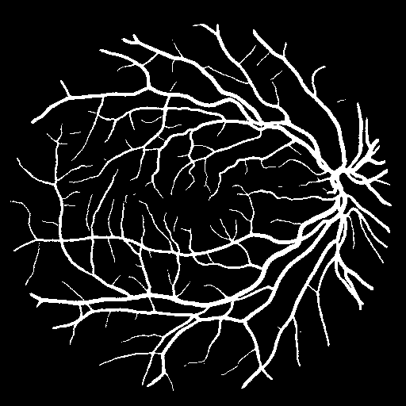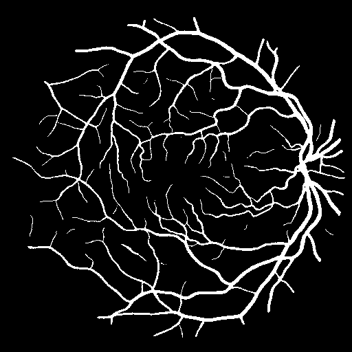

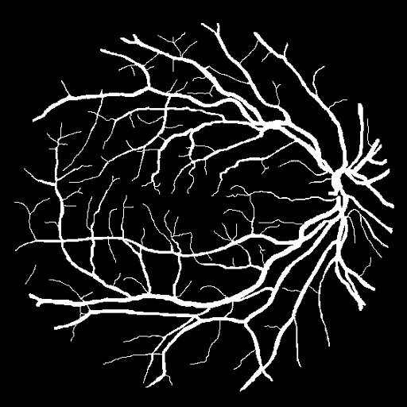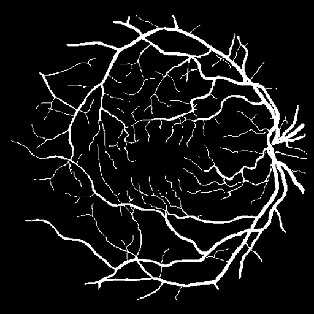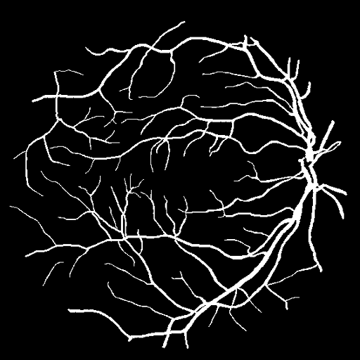

### 结论

对于这个问题，我们研究到这里，似乎已经忘记了这个问题是从何开始的。对于视网膜血管的分割的初衷是为了疾病的预测和诊断。就目前的一些方法来看，仍然存在着许多的问题，对于一些细的血管分割问题和末端的分叉问题没有得到很好地解决。对于那些额外分割出来的血管依旧没有找到很好地办法去辨识。接下来我们或许应该花更多的时间在原图本身上找到关于眼球的奥秘和解决问题的方法。